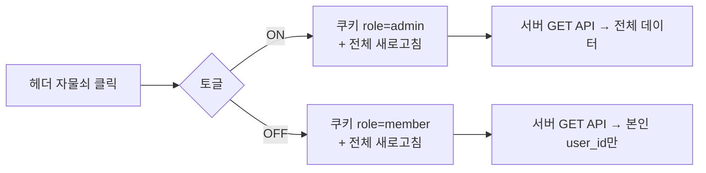
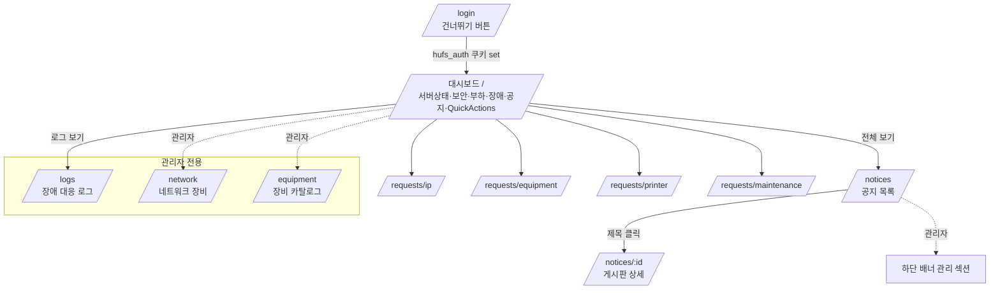
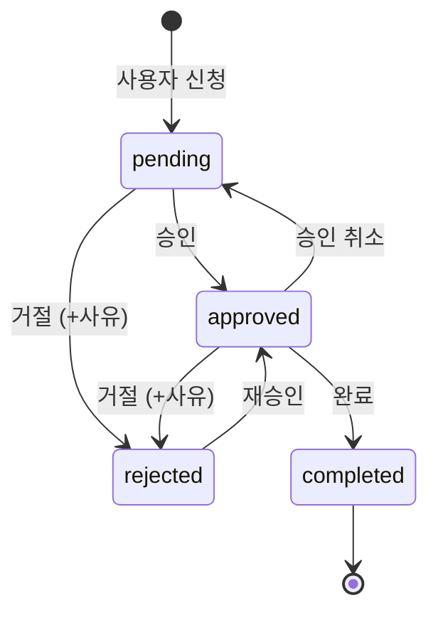
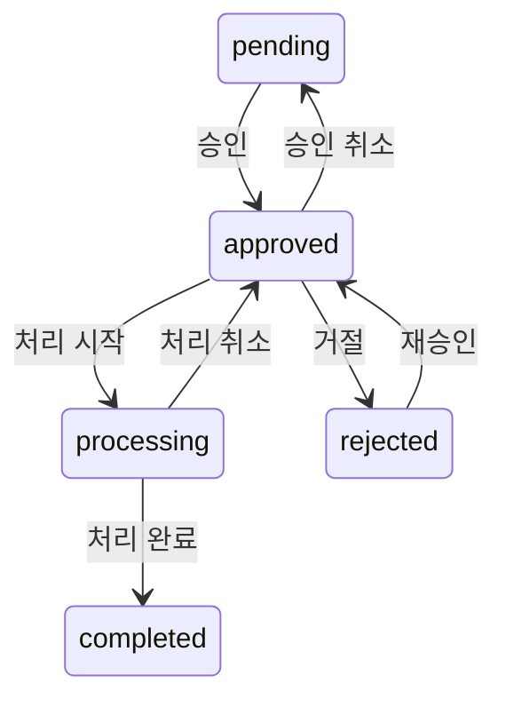
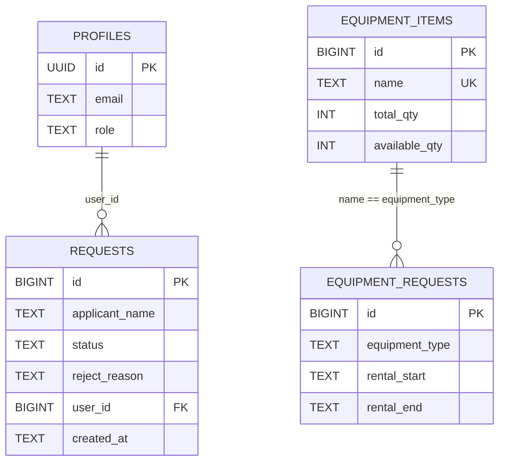

# HUFS ARES-SOC 기능 명세서

> 한국외국어대학교 AI로봇공학과(ARES-SOC) 통합 서버 운영 대시보드
> 작성: 2026-05-25 · 시연 레포: `Cursor_Practice` · 운영 이식 대상: `hufs-ice-server-ops-dashboard-supabase`

---

## 목차

| # | 섹션 |
|---|---|
| 1 | [기술 스택](#1-기술-스택) |
| 2 | [사용자 권한](#2-사용자-권한) |
| 3 | [전체 화면 흐름](#3-전체-화면-흐름) |
| 4 | [페이지별 기능](#4-페이지별-기능) |
| 5 | [신청 상태 전이](#5-신청-상태-전이) |
| 6 | [API 엔드포인트](#6-api-엔드포인트) |
| 7 | [데이터 모델](#7-데이터-모델) |
| 8 | [마이그레이션](#8-마이그레이션) |
| 9 | [호환 레이어](#9-호환-레이어) |
| 10 | [공통 UI 자산](#10-공통-ui-자산) |
| 11 | [시연용 fake vs 운영](#11-시연용-fake-vs-운영) |

---

## 1. 기술 스택

| 영역 | 기술 | 비고 |
|---|---|---|
| 프레임워크 | **Next.js 14.2.35** | App Router |
| 언어 | **TypeScript 5.x** | strict |
| UI | **React 18** + **TailwindCSS 3.x** | 커스텀 색상 토큰 |
| 폰트 | Manrope (display) + Inter (body) | Google Fonts |
| 백엔드 | Next.js Route Handlers | `app/api/**/route.ts` |
| DB | **Supabase** (Postgres + PostgREST) | 클라우드 또는 셀프호스트 |
| DB 접근 | raw REST (`lib/supabase.ts`) | 시그니처 유지 → SDK 교체 가능 |
| 세션 (시연) | 쿠키 기반 fake JSON (`demo_user`) | 이식 시 GoTrue로 교체 |
| 배포 | Vercel (시연) / k3s (운영) | |

---

## 2. 사용자 권한

| Role | 표시 | 권한 |
|---|---|---|
| `admin` / `manager` | 관리자 모드 (🔓 자물쇠 열림) | **모든 신청 조회·승인·거절·완료·상태전환** + **콘텐츠 CRUD** + **카탈로그·배너 관리** |
| `member` | 일반 모드 (🔒 자물쇠 잠김) | **본인 신청 조회·등록** + 공개 공지/장애 열람 |

**서버 가드**: 모든 변경 API에 `requireRole(['admin','manager'])`
**신원 강제 주입**: 신청 POST 시 클라가 보낸 신원 필드 무시, 세션값으로 덮어쓰기

---

## 3. 전체 화면 흐름

---

## 4. 페이지별 기능

### 4.1 대시보드 (`/`)

| 위젯 | 데이터 소스 | 비고 |
|---|---|---|
| 서버실 환경 (온도·습도·가동률·화재) | `soc_server_status` | seed 데이터, k8s 연동 예정 |
| 보안 위협 수준 | `soc_security_status` | seed |
| 서버 부하 (web/db/network/storage) | `soc_server_load` | seed |
| 서버 실시간 모니터링 (8개 노드) | hardcoded | k8s/Prometheus로 교체 예정 |
| 최근 장애 4건 | `soc_incidents` | "로그 보기" → `/logs` |
| 최근 공지 4건 (공개만) | `soc_notices` (is_public) | "전체 보기" → `/notices` |
| 빠른 신청 | 정적 | IP/장비/프린터/유지보수 |

### 4.2 신청 4종 공통 기능

| 기능 | 동작 |
|---|---|
| **SSR 초기 로드** | `page.tsx` (server async) → `*RequestsView` (client)에 `initialRows` prop |
| **권한별 조회** | 일반: 본인 `user_id`만 / 관리자: 전체 |
| **검색** | 신청자명 부분 일치 (대소문자 무시) |
| **상태 필터** | 전체 / 대기중 / 승인 / (처리중*) / 거절 / 완료 |
| **정렬** | 최신순 / 오래된순 |
| **페이지네이션** | 20건/페이지, 페이지 변경 시 첫 페이지로 리셋 |
| **CSV 내보내기** | UTF-8 BOM + 모든 값 `"..."` + 날짜는 TAB prefix (Excel 자동변환 차단) |
| **일괄 처리 (관리자)** | 헤더/행 체크박스 → 선택 N건 일괄 [승인/거절] |
| **반려 사유 모달 (관리자)** | [거절] 클릭 시 사유 입력 모달 → 목록에 빨간 글씨로 표시 |
| **승인 취소** | 잘못 승인했을 때 직전 상태로 복귀 가능 |

*processing은 유지보수만

### 4.3 신청 4종 타입별

| 타입 | 경로 | 입력 필드 | 특이사항 |
|---|---|---|---|
| **IP** | `/requests/ip` | 신청 목적 | 본인정보 readonly prefill |
| **장비 대여** | `/requests/equipment` | 장비 종류(드롭다운), 시작일, 반납일 | 카탈로그 `soc_equipment_items` fetch, "대여 가능 N대" 표시, 가용 0이면 차단 |
| **프린터** | `/requests/printer` | 프린터, 매수 | |
| **유지보수** | `/requests/maintenance` | 장비/시설, 장애 내용, 긴급도 | `processing` 중간 상태 지원 |

### 4.4 공지

| 페이지 | 기능 |
|---|---|
| `/notices` (목록) | 유형 배지, 클릭 → 상세, 관리자에겐 비공개 공지 + "비공개" 배지 + [수정/삭제] |
| `/notices/[id]` (상세) | 게시판식 server component, 본문 표시, 비공개+권한없음 → 🔒 차단 화면 |

**모달 (`NoticeModal`)**: 제목 · 유형 · 본문 · 공개여부

### 4.5 상단 배너 (`Ticker`)

| 항목 | 동작 |
|---|---|
| 데이터 소스 | `/api/banners?active=1` |
| Fallback | fetch 실패 시 하드코딩 텍스트 5건 |
| 관리 UI | `/notices` 페이지 하단 (관리자만): 등록·수정·삭제, 정렬 순서, [활성/비활성] 토글 |

### 4.6 장애 대응 로그 (`/logs`)

| 기능 | 동작 |
|---|---|
| 필터 | 전체 / 처리중 / 완료 |
| 등록 | 제목 · 상세(본문) · 상태 |
| 행 액션 (관리자) | [상태 토글 processing↔done] / [수정] / [삭제] |
| 본문 표시 | 표 내 회색 텍스트 |

### 4.7 네트워크 장비 (`/network`)

| 기능 | 동작 |
|---|---|
| 요약 카드 | 총 / 온라인 / 오프라인 / 주의 개수 |
| 표 | 호스트명 · IP · MAC · 유형 · 마지막 확인 · 상태 |
| 등록/수정 | 호스트명 · IP · MAC · 유형 · 상태(online/warning/offline) |

### 4.8 장비 카탈로그 (`/equipment`)

| 기능 | 동작 |
|---|---|
| 표 | 장비명 · 총 보유 · **대여 가능** · 대여 중 |
| 등록/수정 | 장비명 · 총 수량. 총 수량 수정 시 가용 수량 비례 자동 조정 |
| 연동 | 장비 대여 모달 드롭다운 소스 |
| 재고 흐름 | 대여 승인 시 -1 / 완료·거절·승인취소 시 +1 |

### 4.9 로그인 (`/login`) — *시연용*

- "건너뛰기" 버튼 → `hufs_auth=1` 쿠키 set
- 이식 시 Google OAuth로 교체

---

## 5. 신청 상태 전이

**유지보수 신청만 추가 단계** (`approved → processing → completed`):

**장비 대여 재고 영향**: `approved` 진입 시 `available_qty -1`, `approved` 이탈 시 `+1`

---

## 6. API 엔드포인트

### 6.1 신청 4종

| Method | Path | 권한 | 비고 |
|---|---|---|---|
| `GET` | `/api/requests/{type}` | 인증 | 일반=본인것만, 관리자=전체 |
| `POST` | `/api/requests/{type}` | 인증 | 신원·`user_id` 서버 강제 주입 |
| `PATCH` | `/api/requests/{type}/[id]` | admin/manager | status, reject_reason 처리. equipment은 추가로 재고 차감/복구 |

### 6.2 콘텐츠 리소스

| 리소스 | GET | POST | PATCH | DELETE | 비고 |
|---|---|---|---|---|---|
| `/api/notices` | 누구나 (`?scope=all` = admin) | admin/manager | `[id]` admin | `[id]` admin | `is_public` 분기 |
| `/api/banners` | 누구나 (`?active=1`) | admin/manager | `[id]` admin | `[id]` admin | Ticker용 |
| `/api/incidents` | 누구나 | admin/manager | `[id]` admin | `[id]` admin | |
| `/api/network` | 누구나 | admin/manager | `[id]` admin | `[id]` admin | |
| `/api/equipment-items` | 누구나 (`?available=1`) | admin/manager | `[id]` admin | `[id]` admin | 카탈로그 |

### 6.3 기타

| 경로 | 설명 |
|---|---|
| `GET /api/dashboard` | server_status·security·load·장애4·공개공지4 통합 |
| `POST /api/auth/skip` | 시연용 `hufs_auth=1` 쿠키 set |

**공통 응답 포맷**: `{ success: boolean, data?: T, id?: number, error?: string }`

---

## 7. 데이터 모델

### 테이블 일람

| 테이블 | 주요 컬럼 | 비고 |
|---|---|---|
| `soc_server_status` | temperature, humidity, fire_detected, uptime_percent | id=1 단일 행 |
| `soc_security_status` | threat_level, national_threat_level | id=1 단일 행 |
| `soc_server_load` | web_server, db_server, network, storage | id=1 단일 행 |
| `soc_incidents` | title, **body**, status (processing/done) | |
| `soc_notices` | title, type, **body**, **is_public** | |
| `soc_banners` | text, sort_order, active | Ticker 데이터 |
| `soc_ip_requests` | applicant_name, department, student_id, purpose, status, **reject_reason**, **user_id** | |
| `soc_equipment_requests` | applicant_name, equipment_type, rental_start, rental_end, status, **reject_reason**, **user_id** | |
| `soc_printer_requests` | applicant_name, printer_id, copies, status, **reject_reason**, **user_id** | |
| `soc_maintenance_requests` | applicant_name, equipment_desc, issue_detail, urgency, status, **reject_reason**, **user_id** | |
| `soc_network_devices` | hostname, ip_address, mac_address, device_type, status | |
| `soc_equipment_items` | name (UNIQUE), total_qty, available_qty | 대여 카탈로그 |

> **굵게** = 마이그레이션으로 후속 추가된 컬럼

---

## 8. 마이그레이션

`supabase/migrations/` (순서대로 적용):

| # | 파일 | 내용 |
|---|---|---|
| 1 | `2026_05_21_body_and_banners.sql` | 공지 `body` 컬럼 + `soc_banners` 테이블 |
| 2 | `2026_05_21_incident_body.sql` | 장애 `body` 컬럼 |
| 3 | `2026_05_21_notice_public.sql` | 공지 `is_public` 컬럼 |
| 4 | `2026_05_21_equipment_items.sql` | 장비 카탈로그 테이블 |
| 5 | `2026_05_21_request_reject_userid.sql` | 신청 4종 `reject_reason`, `user_id` + 인덱스 |

---

## 9. 호환 레이어

> 이식 시 **컴포넌트·페이지·API 라우트는 무수정**, 호환 레이어 내부 구현만 교체.

| 파일 | 역할 | Cursor_Practice | ops-dashboard 이식 |
|---|---|---|---|
| `lib/session.ts` | 서버 세션 | `demo_user` 쿠키 파싱 | `@supabase/ssr` + `auth.getUser()` + `profiles` 조인 |
| `lib/session-client.tsx` | 클라 세션 | `SessionProvider` props 전달 | Supabase auth 구독 추가 |
| `lib/tables.ts` | 테이블명 상수 | `soc_*` prefix | prefix 없는 이름 |
| `lib/supabase.ts` | DB 접근 | raw REST | `@supabase/ssr` SDK |
| `lib/queries.ts` | 모든 CRUD | 시그니처 고정 — **변경 없음** | — |

---

## 10. 공통 UI 자산

| 컴포넌트 | 위치 | 용도 |
|---|---|---|
| `Modal` + `FormField`/`Input`/`Select`/`Textarea`/`ModalActions` | `components/Modal.tsx` | 모든 모달의 베이스 |
| `StatusBadge` · `ActionButtons` · `RequestTabs` | `components/admin/RequestManage.tsx` | 신청 상태·액션, 거절 시 사유 모달 통합 |
| `RequestFilters` · `Pagination` | `components/admin/RequestFilters.tsx` | 검색·필터·정렬 + 페이지 컨트롤 |
| `Sidebar` | `components/Sidebar.tsx` | role별 다른 메뉴 |
| `Ticker` | `components/Ticker.tsx` | 상단 배너 (DB fetch + fallback) |
| `downloadCsv` · `todayLocal` | `lib/csv.ts` | CSV 헬퍼 |
| `*Modal.tsx` (8종) | `components/modals/*` | IP/Equipment/Printer/Maintenance/Notice/Incident/Banner/NetworkDevice/EquipmentItem |

---

## 11. 시연용 fake vs 운영

| 항목 | 시연 (현재) | 운영 (이식 후) |
|---|---|---|
| 로그인 | `/login` "건너뛰기" → `hufs_auth=1` | Google OAuth 콜백 |
| 세션 사용자 | `DEMO_USER` 상수 + 쿠키 토글 | `auth.getUser()` + `profiles.role` |
| 권한 변경 | 헤더 자물쇠 토글 | Supabase Studio에서 SQL |
| 알림 | (미구현) | 추후 Resend |
| 모니터링 데이터 | seed 행 | k8s Node Exporter → Prometheus → ingest API |
| Storage | (사용 안 함) | (현재까지) 사용 안 함 |

---

*상세 운영 인프라는 [`K3S_DEPLOYMENT.md`](./K3S_DEPLOYMENT.md), 미구현 로드맵은 [`NEXT_STEPS.md`](./NEXT_STEPS.md) 참고.*
