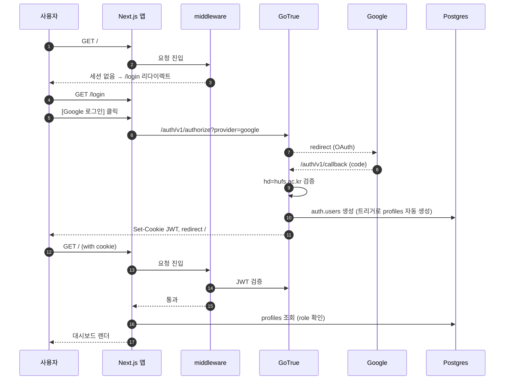
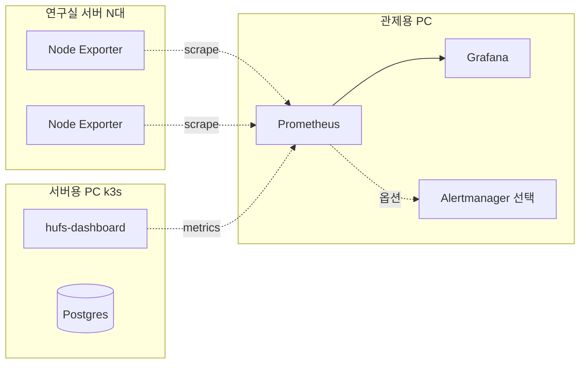
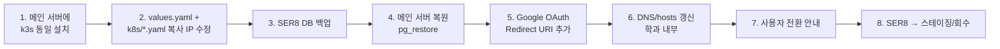

# k3s 배포 구조 문서

> 이 앱이 `hufs-ice-server-ops-dashboard-supabase`로 이식된 후의 **실제 운영 구조**
> 작성: 2026-05-25 · 선행 문서: ops-dashboard 레포의 `서버종합상황실_개발_가이드.md`

---

## 목차

| # | 섹션 |
|---|---|
| 1 | [결정 사항 요약](#1-결정-사항-요약) |
| 2 | [전체 토폴로지](#2-전체-토폴로지) |
| 3 | [Pod·Service 구성](#3-podservice-구성) |
| 4 | [k3s 셋업](#4-k3s-셋업) |
| 5 | [Supabase 셀프호스트](#5-supabase-셀프호스트) |
| 6 | [Next.js 앱 배포](#6-nextjs-앱-배포) |
| 7 | [Dockerfile](#7-dockerfile) |
| 8 | [Google OAuth 인증 흐름](#8-google-oauth-인증-흐름) |
| 9 | [권한 모델](#9-권한-모델) |
| 10 | [모니터링](#10-모니터링) |
| 11 | [운영 자동화](#11-운영-자동화) |
| 12 | [메인 서버 이전](#12-메인-서버-이전) |
| 13 | [자주 쓰는 명령](#13-자주-쓰는-명령) |
| 14 | [이식 체크리스트](#14-이식-체크리스트) |

---

## 1. 결정 사항 요약

| 항목 | 결정 | 비고 |
|---|---|---|
| 오케스트레이션 | **k3s** (경량 K8s) | 단일 노드 시작 → 노드 추가 가능 |
| 컨테이너 런타임 | Docker (개발) / containerd (운영) | k3s 내장 containerd |
| 백엔드 | **셀프호스트 Supabase** | Postgres + GoTrue + PostgREST + Kong |
| 인증 | **Google OAuth** | `@hufs.ac.kr` Workspace 제한 |
| 이미지 빌드 | 노트북 → Docker Hub (public) | |
| 외부 도메인 | **사용 안 함** | 학과 내부망 IP+포트 |
| HTTPS | 미적용 | 내부망 한정 |
| 검증 환경 | SER8 (Ubuntu, 64GB) | |
| 운영 환경 | 메인 서버 | 디스크 1TB |
| 모니터링 | 관제 PC + Prometheus + Grafana | 별도 시스템 |

---

## 2. 전체 토폴로지

```mermaid
flowchart TB
    User[학과 내부망 사용자<br/>브라우저]

    subgraph SERVER[서버용 PC · k3s single node]
      direction TB
      subgraph DEFAULT[Namespace: default]
        APP[Deployment: hufs-dashboard<br/>Next.js · 2 replicas]
        SVC1[Service NodePort 30000]
        APP --- SVC1
      end
      subgraph SUPA[Namespace: supabase]
        KONG[Kong Gateway]
        SVC2[Service NodePort 30001]
        AUTH[GoTrue<br/>Google OAuth]
        REST[PostgREST]
        DB[(Postgres · PVC 20Gi)]
        KONG --- SVC2
        KONG --> AUTH
        KONG --> REST
        AUTH --> DB
        REST --> DB
      end
      APP -.."NEXT_PUBLIC_SUPABASE_URL = http://IP:30001".-> KONG
    end

    User -->|http :30000| SVC1
    User -.."OAuth 콜백".-> SVC2

    subgraph 관제[관제용 PC]
      PROM[Prometheus]
      GRAF[Grafana]
    end
    SERVER -.."Node Exporter 메트릭".-> PROM
    PROM --> GRAF
```

---

## 3. Pod·Service 구성

| Namespace | 리소스 | 종류 | 노출 | 설명 |
|---|---|---|---|---|
| `default` | `hufs-dashboard` | Deployment | NodePort **30000** | Next.js 2 replicas |
| `supabase` | `kong` | Service | NodePort **30001** | Auth/REST 게이트웨이 |
| `supabase` | `auth` | Deployment | (internal) | GoTrue |
| `supabase` | `rest` | Deployment | (internal) | PostgREST |
| `supabase` | `db` | StatefulSet | (internal) | Postgres + PVC 20Gi (local-path) |
| `supabase` | `studio` | (메인서버만) | NodePort (선택) | Supabase Studio UI |

---

## 4. k3s 셋업

### 4.1 설치 (64GB 파티션 사용)

```bash
sudo mkdir -p /data/k3s
curl -sfL https://get.k3s.io | \
  INSTALL_K3S_EXEC="--data-dir /data/k3s --write-kubeconfig-mode 644" sh -
```

### 4.2 kubeconfig

```bash
mkdir -p ~/.kube
sudo cp /etc/rancher/k3s/k3s.yaml ~/.kube/config
sudo chown $USER:$USER ~/.kube/config
```

### 4.3 로그 cap (필수)

`/etc/rancher/k3s/config.yaml`:
```yaml
kubelet-arg:
  - "container-log-max-size=50Mi"
  - "container-log-max-files=3"
```

```bash
sudo systemctl restart k3s
sudo sed -i 's/^#SystemMaxUse=.*/SystemMaxUse=500M/' /etc/systemd/journald.conf
sudo systemctl restart systemd-journald
```

### 4.4 Helm

```bash
curl https://raw.githubusercontent.com/helm/helm/main/scripts/get-helm-3 | bash
helm repo add supabase https://supabase-community.github.io/supabase-kubernetes
helm repo update
```

---

## 5. Supabase 셀프호스트

### 5.1 `~/supabase-values.yaml` 핵심 부분

| 키 | 값 | 비고 |
|---|---|---|
| `studio.enabled` | `false` (SER8) / `true` (메인) | 관리 UI |
| `storage.enabled` | `false` | 코드에서 `supabase.storage` 미사용 |
| `realtime.enabled` | `false` | `channel` 미사용 |
| `db.persistence.size` | `20Gi` | local-path StorageClass |
| `db.password` | (강력한 비밀번호) | |
| `auth.environment.GOTRUE_EXTERNAL_GOOGLE_ENABLED` | `"true"` | |
| `auth.environment.GOTRUE_EXTERNAL_GOOGLE_CLIENT_ID` | (Google Console에서) | |
| `auth.environment.GOTRUE_EXTERNAL_GOOGLE_SECRET` | (Google Console에서) | |
| `auth.environment.GOTRUE_EXTERNAL_GOOGLE_REDIRECT_URI` | `http://<SER8_IP>:30001/auth/v1/callback` | |
| `kong.service.type` | `NodePort` | |
| `kong.service.nodePort` | `30001` | |

### 5.2 배포

```bash
kubectl create namespace supabase
helm install supabase supabase/supabase -n supabase -f ~/supabase-values.yaml
kubectl get pods -n supabase -w
```

### 5.3 스키마 적용

```bash
DB_POD=$(kubectl get pods -n supabase -l app=supabase-db -o jsonpath='{.items[0].metadata.name}')
kubectl cp ./supabase/schema.sql supabase/$DB_POD:/tmp/schema.sql
kubectl exec -n supabase $DB_POD -- psql -U postgres -f /tmp/schema.sql

# migrations/ 순서대로
for f in supabase/migrations/*.sql; do
  kubectl cp "$f" supabase/$DB_POD:/tmp/m.sql
  kubectl exec -n supabase $DB_POD -- psql -U postgres -f /tmp/m.sql
done
```

---

## 6. Next.js 앱 배포

### 6.1 이미지 빌드 (노트북)

```powershell
docker build -t <DockerHubID>/hufs-dashboard:latest .
docker push <DockerHubID>/hufs-dashboard:latest
```

### 6.2 Kubernetes 리소스 파일

| 파일 | 종류 | 핵심 |
|---|---|---|
| `k8s/deployment.yaml` | Deployment | 2 replicas, env 주입, resources limits |
| `k8s/service.yaml` | Service (NodePort 30000) | targetPort 3000 |
| `k8s/secret.yaml` | Secret `supabase-keys` | anon-key, service-role-key |
| `k8s/ingress.yaml` *(선택)* | Ingress | 내부 DNS 등록 시 |

### 6.3 Deployment 핵심 (요지)

```yaml
spec:
  replicas: 2
  template:
    spec:
      containers:
        - image: <DockerHubID>/hufs-dashboard:latest
          ports: [{ containerPort: 3000 }]
          resources:
            limits:   { cpu: 500m, memory: 512Mi }
            requests: { cpu: 100m, memory: 128Mi }
          env:
            - { name: NEXT_PUBLIC_SUPABASE_URL, value: "http://<SER8_IP>:30001" }
            - name: NEXT_PUBLIC_SUPABASE_ANON_KEY
              valueFrom: { secretKeyRef: { name: supabase-keys, key: anon-key } }
            - name: SUPABASE_SERVICE_ROLE_KEY
              valueFrom: { secretKeyRef: { name: supabase-keys, key: service-role-key } }
```

### 6.4 anon/service 키 추출 + Secret 생성

```bash
ANON=$(kubectl get secret -n supabase supabase-supabase-jwt -o jsonpath='{.data.anonKey}' | base64 -d)
SVC=$(kubectl get secret -n supabase supabase-supabase-jwt -o jsonpath='{.data.serviceKey}' | base64 -d)
kubectl create secret generic supabase-keys \
  --from-literal=anon-key="$ANON" \
  --from-literal=service-role-key="$SVC"
```

### 6.5 배포 + 접속

```bash
kubectl apply -f k8s/
kubectl rollout status deployment/hufs-dashboard
```

- 대시보드: `http://<SER8_IP>:30000`
- Supabase API: `http://<SER8_IP>:30001`

---

## 7. Dockerfile

`Dockerfile` (Next.js standalone, multi-stage)

```dockerfile
FROM node:20-alpine AS deps
WORKDIR /app
COPY package*.json ./
RUN npm ci

FROM node:20-alpine AS builder
WORKDIR /app
COPY --from=deps /app/node_modules ./node_modules
COPY . .
RUN npm run build

FROM node:20-alpine AS runner
WORKDIR /app
ENV NODE_ENV=production
RUN addgroup -g 1001 -S nodejs && adduser -S nextjs -u 1001
COPY --from=builder /app/public ./public
COPY --from=builder --chown=nextjs:nodejs /app/.next/standalone ./
COPY --from=builder --chown=nextjs:nodejs /app/.next/static ./.next/static
USER nextjs
EXPOSE 3000
CMD ["node", "server.js"]
```

> **전제**: `next.config.mjs`에 `output: 'standalone'`

---

## 8. Google OAuth 인증 흐름



### Google Cloud Console 설정

| 항목 | 값 |
|---|---|
| OAuth consent screen | User Type = **Internal** (HUFS Workspace 한정) |
| OAuth Client ID | Application type = Web |
| Authorized redirect URIs | `http://<SER8_IP>:30001/auth/v1/callback` |

---

## 9. 권한 모델 (DB)

```sql
CREATE TABLE public.profiles (
  id UUID PRIMARY KEY REFERENCES auth.users(id) ON DELETE CASCADE,
  email TEXT NOT NULL UNIQUE,
  full_name TEXT,
  role TEXT NOT NULL DEFAULT 'member',  -- 'admin' | 'manager' | 'member'
  created_at TIMESTAMPTZ DEFAULT NOW()
);
```

| 함수/트리거 | 역할 |
|---|---|
| `handle_new_user()` (트리거) | 첫 로그인 시 profiles 자동 생성 |
| `enforce_hufs_domain()` (트리거) | `@hufs.ac.kr` 외 차단 (앱 + DB 이중) |

**초기 관리자 지정**: Supabase Studio에서 `UPDATE profiles SET role='admin' WHERE email='...'`

---

## 10. 모니터링



| 원칙 | 내용 |
|---|---|
| 연구실 서버 ≠ k3s 멤버 | Node Exporter만 설치, k8s 클러스터 무관 |
| 메트릭 수집 | 관제 PC Prometheus가 scrape |
| 시각화 | 기존 Grafana 인스턴스 유지 |
| 향후 통합 | 대시보드에서 iframe 임베드 또는 Prometheus 직접 쿼리 |

---

## 11. 운영 자동화

### 11.1 주간 이미지 prune

`/etc/cron.weekly/k3s-cleanup`:
```bash
#!/bin/bash
/usr/local/bin/k3s crictl rmi --prune
```

### 11.2 일일 DB 백업

`/etc/cron.daily/supabase-backup`:
```bash
#!/bin/bash
DATE=$(date +%Y%m%d)
DB_POD=$(kubectl get pods -n supabase -l app=supabase-db -o jsonpath='{.items[0].metadata.name}')
kubectl exec -n supabase $DB_POD -- pg_dumpall -U postgres | gzip > /backup/supabase-$DATE.sql.gz
find /backup -name "supabase-*.sql.gz" -mtime +7 -delete
```

> ⚠ `/backup`은 **다른 디스크에 마운트**. 같은 64GB 파티션이면 동반 손실.

### 11.3 헬스체크

| 명령 | 확인 |
|---|---|
| `kubectl top nodes` | 노드 CPU/메모리 |
| `kubectl get pods -A` | 모든 Pod 상태 |
| `df -h` | 디스크 잔여 |
| `du -sh /data/k3s` | k3s 데이터 크기 |

---

## 12. 메인 서버 이전



---

## 13. 자주 쓰는 명령

### k3s 상태
```bash
sudo systemctl status k3s
kubectl get nodes
kubectl get pods -A
```

### 로그
```bash
kubectl logs -f -n supabase <pod-name>
kubectl logs -f deployment/hufs-dashboard
```

### 재배포 (이미지 업데이트 후)
```bash
docker push <DockerHubID>/hufs-dashboard:latest
kubectl rollout restart deployment/hufs-dashboard
```

### DB 접속
```bash
kubectl exec -it -n supabase <db-pod-name> -- psql -U postgres
```

### 정리
```bash
sudo k3s crictl rmi --prune
docker system prune -a   # 노트북에서
```

### Helm 업그레이드
```bash
helm upgrade supabase supabase/supabase -n supabase -f ~/supabase-values.yaml
```

---

## 14. 이식 체크리스트

> `Cursor_Practice` → `ops-dashboard`로 옮길 때 K8s 측면 추가 작업

- [ ] `lib/supabase.ts` raw REST → `@supabase/ssr` + Kong NodePort URL
- [ ] `lib/session.ts` 쿠키 fake → `createServerClient` + `auth.getUser()` + `profiles` 조인
- [ ] `middleware.ts` 쿠키 체크 → Supabase 세션 미들웨어
- [ ] `/login` 페이지 → Google OAuth 시작 버튼
- [ ] K8s Secret: `NEXT_PUBLIC_SUPABASE_URL` / `NEXT_PUBLIC_SUPABASE_ANON_KEY` / `SUPABASE_SERVICE_ROLE_KEY`
- [ ] `supabase/migrations/*.sql` → 한 schema.sql로 통합 후 Postgres pod에서 실행
- [ ] RLS 정책 추가 (service_role 우회 중이지만 보안 강화)
- [ ] Dockerfile 최적화 (위 7번)
- [ ] `k8s/{deployment,service,secret,ingress}.yaml` 작성
- [ ] Google Cloud Console OAuth Client ID 발급 (Internal User Type)

---

*상세 단계별 명령은 ops-dashboard 레포의 `서버종합상황실_개발_가이드.md` 함께 참고. 기능 명세는 [`FEATURES.md`](./FEATURES.md), 미구현은 [`NEXT_STEPS.md`](./NEXT_STEPS.md).*
